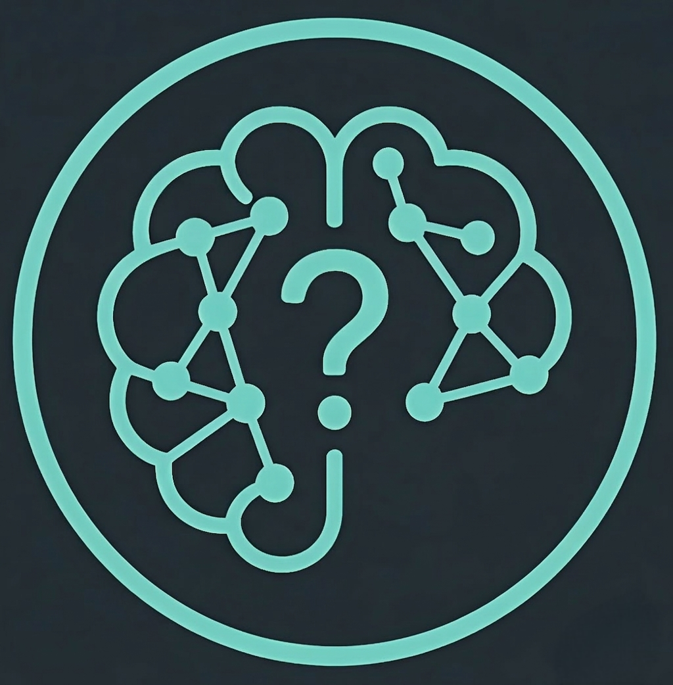
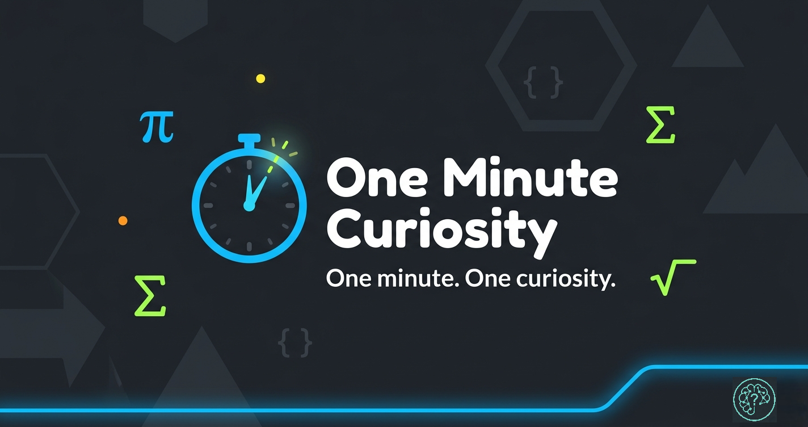

#  One-Minute Curiosity - Laboratory Notebook

[](https://github.com/sundrabomjan/one-minute-curiosity)

> **"Code is a window into curiosity."** 
> This repository is a clean, organized archive of experiments, puzzles, and code-based insights shared on the **One-Minute Curiosity** TikTok channel.

---

## The Laboratory Index

Each entry in this notebook represents a specific curiosity. Inside each folder, you will find:
- `code.py`: The cleanest, most minimal logic used in the video.
- `explanation.md`: A deep dive into the "Why" and "How."
- `visual.png`: Quick visual reference (where applicable).

### Curiosities (Chronological)

| Episode | Curiosity | Logic | Explanation |
| :--- | :--- | :--- | :--- |
| **01** | [Kaprekar's Constant (6174)](./episode-01-kaprekar/) | [code.py](./episode-01-kaprekar/code.py) | [Explore](./episode-01-kaprekar/explanation.md) |

---

## Exploring the Lab

1. **Clone the Repo**:
   ```bash
   git clone https://github.com/sundrabomjan/one-minute-curiosity.git
   ```
2. **Standardized Folders**: Use hyphenated-lower-case for names.
3. **Run Anything**: Usually just `python code.py`.

## Standards
To keep the lab clean and high-quality, we follow a strict documentation standard. See [CONTRIBUTING.md](./CONTRIBUTING.md) for the blueprint.

---
*Maintained by [One-Minute Curiosity](https://tiktok.com/@oneminutecuriosity)*
